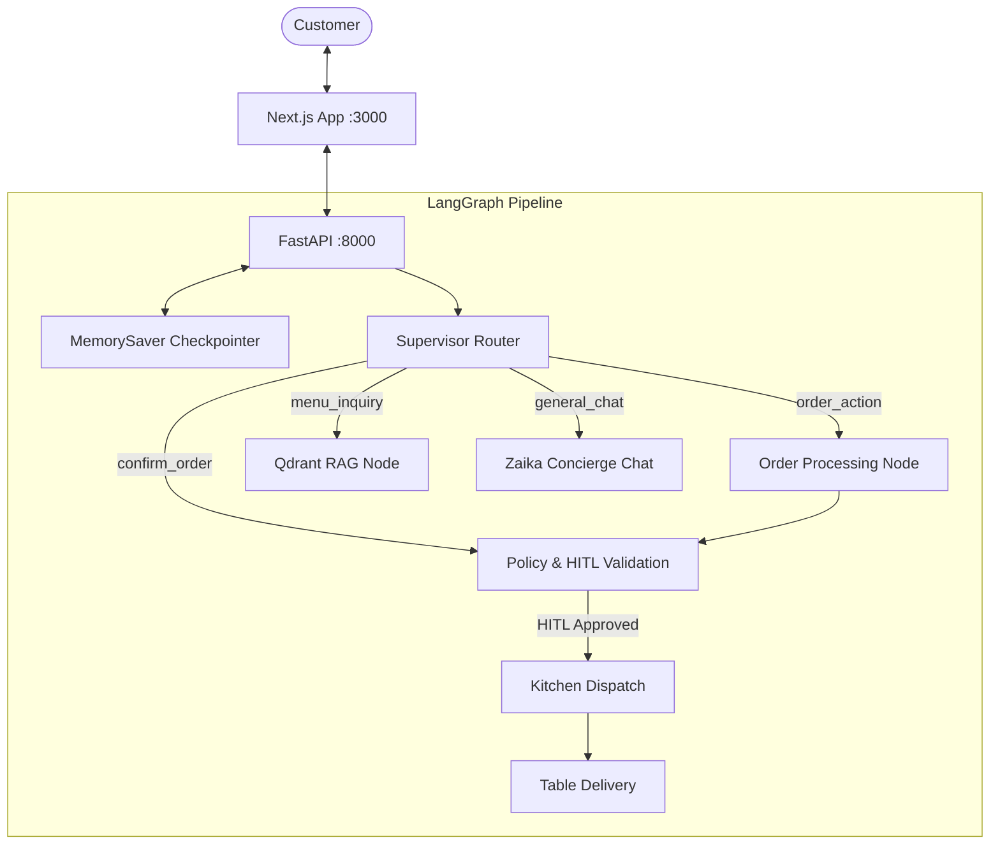

# ZaikaAI Restaurant Agent — Architecture & Workflow Cheatsheet

This skill outlines the core workflows, state mutations, and implementation rules for the **ZaikaAI** application.

---

## 🧭 System Topology



---

## 🗂️ Core Files Map

- **State Model**: `agent/state.py` (`RestaurantState`, `CartItem`, `AgentTrace`)
- **Multi-Agent Graph**: `agent/graph.py` (Compiled `StateGraph` with checkpointer)
- **Node Implementations**: `agent/nodes.py` (Router, RAG, Order Entity Extraction, HITL Gate, Kitchen Dispatch)
- **Vector & Fuzzy Search**: `agent/rag.py` (`RapidFuzz` WRatio matching + `Qdrant` vector search + generic category disambiguation)
- **API Endpoints**: `api.py` (FastAPI endpoints on `:8000`)
- **Dataset**: `menu.json` (18 dishes with prices in Rs., calories, prep times, allergens)
- **Frontend Dashboard**: `frontend/app/page.tsx` & `frontend/components/ChatAssistant.tsx`

---

## 📋 State Schema (`agent/state.py`)

```python
class CartItem(TypedDict):
    slug: str
    name: str
    price: float
    quantity: int
    notes: Optional[str]

class RestaurantState(TypedDict):
    session_id: str
    customer_name: Optional[str]
    user_message: str
    messages: List[Dict[str, str]]
    cart: List[CartItem]
    subtotal: float
    tax: float
    total: float
    order_status: str  # "browsing" | "draft" | "awaiting_approval" | "confirmed" | "cooking" | "ready" | "served"
    hitl_required: bool
    hitl_reason: Optional[str]
    agent_trace: List[Dict[str, str]]
    response: str
    suggested_prompts: List[str]
```

---

## ⚡ Key Implementation Patterns

### 1. Multi-Turn Disambiguation & Confirmation
- When a customer types a short follow-up (e.g. `"wild pizza"`, `"smoky paneer"`, `"first one"`) or confirmation (`"yes"`, `"sure"`, `"add it"`):
  - `supervisor_router_node` checks the **last assistant message** to classify as `order_action`.
  - `order_processing_node` extracts the target dish from conversation context and adds it to the cart.

### 2. Typo-Tolerant Category Matching
- `get_category_matches(query)` in `agent/rag.py` recognizes generic terms like `pizza`, `piiza`, `burger`, `burgur`, `pasta`, `drink`, `dessert` with $\ge 78\%$ fuzzy similarity.
- If multiple varieties exist, it prompts the user with the exact choices.

### 3. Clean Text Rule
- Chat responses must never include raw markdown bold/italic asterisks (`**bold**`). Always filter via `_clean_text()` before returning to user.

### 4. Human-in-the-Loop Threshold
- Orders with `total >= 1000.0` or custom preparation notes trigger `hitl_required = True`.
