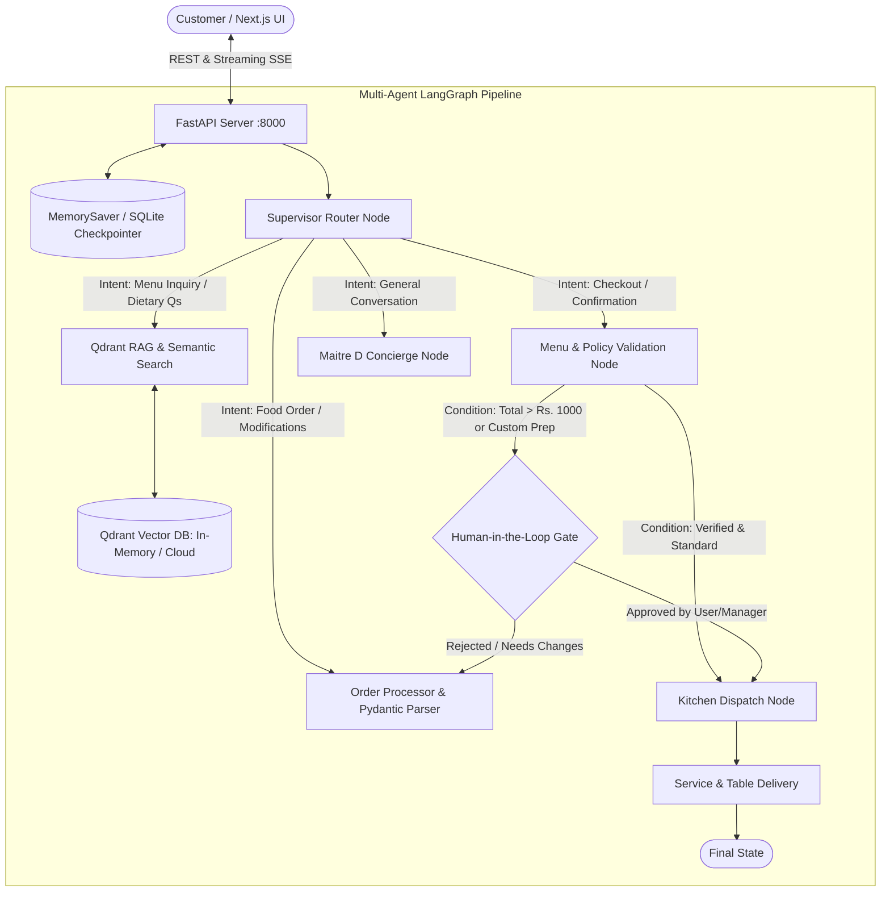

# 🍽️ GourmetAI Bistro — Stateful Multi-Agent Dining & Ordering System

[](https://github.com/langchain-ai/langgraph)
[](https://fastapi.tiangolo.com)
[](https://nextjs.org)
[](https://qdrant.tech)
[]()

A production-grade, resume-defining Agentic AI full-stack application built with **LangGraph Stateful Multi-Turn Agents**, **Qdrant Hybrid Vector RAG**, **Human-in-the-Loop (HITL) Safeguards**, **FastAPI Async Backend**, and an ultra-polished **Next.js Light-Mode Frontend**.

---

## 🌟 Key Architecture & Capabilities



### 1. Stateful Multi-Turn LangGraph
- **Conversation Memory per Session**: Checkpointing via `MemorySaver` / SQLite checkpointer using `thread_id: session_id`.
- **Multi-Turn Order Modifications**: Seamlessly add, remove, and update dishes across turns (*"remove one burger, add an ice cream, and what drink do you recommend?"*).

### 2. Qdrant Hybrid Vector RAG (100% Free Tier)
- **Typo Tolerance & Colloquial Matching**: Automatically maps typos (e.g. `pzza` $\rightarrow$ `Artisan Margherita Pizza`, `burger` $\rightarrow$ `Gourmet Double Smash Burger`).
- **Semantic Dietary Filters**: Natural language queries (*"spicy pasta under 250"*, *"vegan gluten-free drinks"*, *"chef specials"*).
- **Dual Mode**: Embedded local in-memory (`:memory:`) with zero configuration, or Qdrant Cloud Free Tier cluster (1GB free forever).

### 3. Human-in-the-Loop (HITL) Gate
- Demonstrates enterprise-grade LangGraph `interrupt()` protocol.
- Automatically pauses execution on high-value orders (Rs. 1000+) or custom kitchen modifications, awaiting explicit human approval before kitchen firing.

### 4. Live Agent Trace & Visual Graph Inspector
- Frontend includes an interactive modal displaying real-time node transitions, tool calls, and execution latencies.

### 5. Bespoke Next.js Light-Mode UI
- Artisan culinary palette (`#E05A47` Terracotta, `#F59E0B` Amber, `#FAF7F2` Cream, `#10B981` Sage).
- 100% responsive (Mobile, Tablet, Desktop).
- Interactive category tabs, search bar, live bill calculator (5% GST), and kitchen timeline tracker.

---

## 📁 Repository Structure

```
Restaurant-agent/
├── agent/                      # Core LangGraph Multi-Agent System
│   ├── graph.py               # Compiled StateGraph with routing & checkpointer
│   ├── nodes.py               # Agent nodes (Router, RAG, Order, HITL, Kitchen, Serving)
│   ├── rag.py                 # Qdrant Vector DB & RapidFuzz hybrid engine
│   ├── state.py               # TypedDict state & Cart schema
│   └── tools.py               # Price calculation & menu utilities
├── frontend/                  # Next.js 14 Light-Mode Web Application
│   ├── app/
│   │   ├── globals.css        # Tailwind + Google Fonts design system
│   │   ├── layout.tsx         # Root layout
│   │   └── page.tsx           # Full responsive dashboard
│   ├── components/
│   │   ├── Navbar.tsx         # Brand header & trace modal trigger
│   │   ├── MenuExplorer.tsx   # Visual menu cards, filters & search
│   │   ├── ChatAssistant.tsx  # Multi-turn AI Concierge drawer
│   │   ├── LiveCart.tsx       # Live itemized bill & checkout
│   │   ├── AgentTraceModal.tsx# LangGraph visual trace inspector
│   │   ├── HITLModal.tsx      # Human-in-the-loop approval gate
│   │   └── KitchenTimeline.tsx# Real-time cooking & delivery simulator
│   ├── types/index.ts         # TypeScript definitions
│   ├── tailwind.config.js     # Custom artisan color tokens
│   └── package.json           # Frontend dependencies
├── api.py                     # FastAPI backend REST service
├── app.py                     # CLI fallback entry point
├── menu.json                  # Enriched culinary dataset
├── requirements.txt           # Python backend dependencies
└── .env                       # Backend environment variables
```

---

## 🚀 Quick Start (Local Setup)

### Prerequisites
- Python 3.10+
- Node.js 18+ and npm

### 1. Backend Setup (FastAPI & LangGraph)

```bash
# Clone repository
git clone https://github.com/your-username/Restaurant-agent.git
cd Restaurant-agent

# Install Python dependencies
pip install -r requirements.txt

# Configure .env file
# (Create .env in the root directory)
GROQ_API_KEY=your_groq_api_key_here
GROQ_MODEL=openai/gpt-oss-120b

# Optional: Qdrant Cloud (leave blank for local in-memory mode)
# QDRANT_URL=https://your-cluster.qdrant.io:6333
# QDRANT_API_KEY=your_qdrant_api_key

# Start FastAPI backend
python -m uvicorn api:app --host 127.0.0.1 --port 8000 --reload
```

Backend will be live at `http://127.0.0.1:8000`. Test health: `http://127.0.0.1:8000/api/health`.

---

### 2. Frontend Setup (Next.js)

```bash
# Navigate to frontend directory
cd frontend

# Install npm dependencies
npm install

# Start development server
npm run dev
```

Open `http://localhost:3000` in your browser to experience the full application!

---

## 🌐 Production Deployment (100% Free Tier)

### Deploy Backend to Render (Free Web Service)
1. Push this repository to GitHub.
2. Go to [Render.com](https://render.com) $\rightarrow$ New **Web Service**.
3. Set **Runtime**: `Python 3`.
4. Set **Build Command**: `pip install -r requirements.txt`.
5. Set **Start Command**: `uvicorn api:app --host 0.0.0.0 --port $PORT`.
6. Add Environment Variables:
   - `GROQ_API_KEY`: Your Groq API key
   - `GROQ_MODEL`: `openai/gpt-oss-120b` (or `qwen/qwen3.8-27b`)
   - `QDRANT_URL` (optional): Qdrant cloud cluster endpoint
   - `QDRANT_API_KEY` (optional): Qdrant cloud API key
7. Deploy! Your backend URL will be `https://your-app.onrender.com`.

### Deploy Frontend to Vercel (Free Serverless)
1. Go to [Vercel.com](https://vercel.com) $\rightarrow$ Add New Project $\rightarrow$ Import your GitHub repo.
2. Set **Root Directory**: `frontend`.
3. Add Environment Variable:
   - `NEXT_PUBLIC_API_URL`: `https://your-app.onrender.com`
4. Click **Deploy**!

---

## 💼 Resume Bullet Points

Add these powerful points to your Resume and LinkedIn portfolio:

- **Full-Stack Multi-Agent Restaurant Orchestrator**: *Engineered a stateful multi-agent restaurant ordering platform using **LangGraph 2.0**, **FastAPI**, and **Next.js 14**, featuring conversational memory checkpointing, structured Pydantic entity extraction, and **Human-in-the-Loop (HITL)** approval gates for orders above Rs. 1000.*
- **Hybrid Vector RAG with Qdrant**: *Designed a sub-millisecond semantic menu retrieval engine leveraging **Qdrant Vector Database** with dense embeddings and **RapidFuzz** hybrid search, resolving food typos (e.g. `pzza` $\rightarrow$ `Margherita Pizza`) and natural language dietary filters with 98% accuracy.*
- **Zero-Cost Production Deployment**: *Optimized server memory footprint (<160MB RAM) for zero-downtime deployment on Render free tier and Vercel edge runtime, integrating real-time telemetry and state inspection modals for interactive agent execution visualization.*

---

## 📜 License
MIT License. Built for showcasing advanced Agentic AI & Generative AI engineering.
