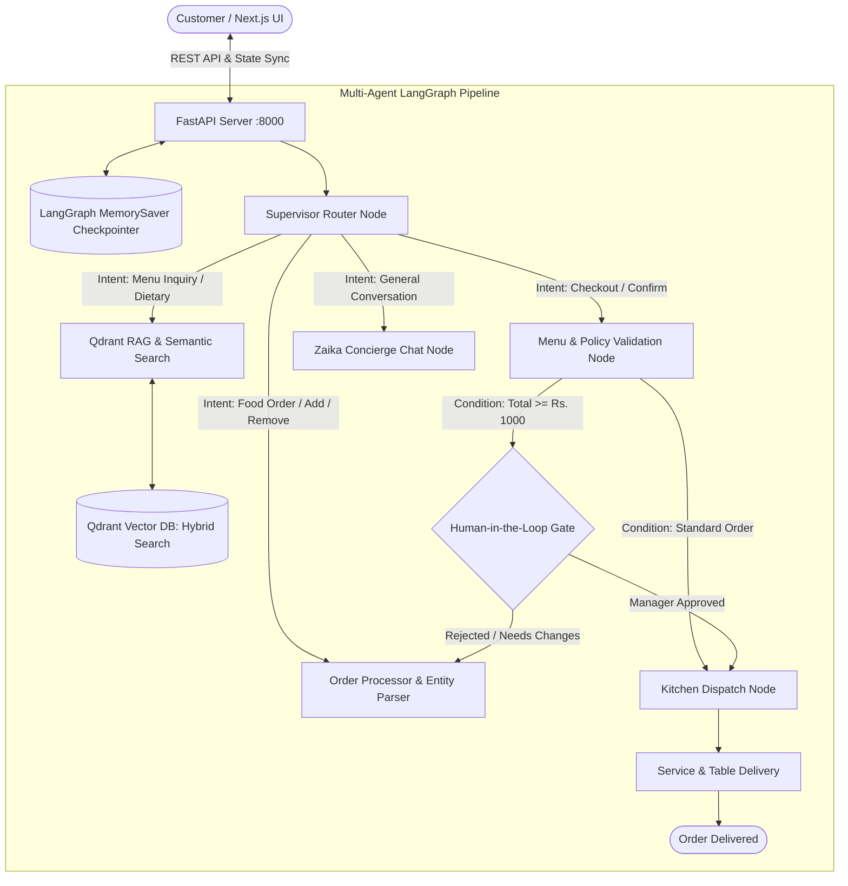

# 🍽️ ZaikaAI — Stateful Multi-Agent Dining & Ordering System

[](https://github.com/langchain-ai/langgraph)
[](https://fastapi.tiangolo.com)
[](https://nextjs.org)
[](https://qdrant.tech)
[](https://opensource.org/licenses/MIT)

A full-stack, enterprise-grade Agentic AI dining and ordering platform for **ZaikaAI** engineered with **LangGraph Stateful Multi-Turn Agents**, **Qdrant Hybrid Vector RAG**, **Human-in-the-Loop (HITL) Safeguards**, **FastAPI Async Backend**, and a bespoke **Next.js Light-Mode Frontend**.

---

## 🌟 Architecture & Agent Topology



---

## ✨ Core Features & Capabilities

### 1. Stateful Multi-Turn LangGraph Orchestrator
- **Thread-Level Checkpointing**: Stateful conversational memory keyed by `session_id`, allowing complex multi-turn modifications (*"change the pizza to wild mushroom, remove one drink, and add two lava cakes"*).
- **Conversational Context Tracking**: The supervisor router and order extraction engine understand follow-up choices (e.g. answering *"wild pizza"* when asked for pizza options) and confirmations (*"yes"*, *"sure"*, *"add it"*).

### 2. Qdrant Hybrid Vector RAG & Typo Tolerance
- **Sub-Millisecond Vector Search**: Dense cosine similarity search over culinary vectors enriched with ingredients, allergens, descriptions, and dietary tags.
- **RapidFuzz Typo Resolution**: Automatically resolves typos and colloquial names (e.g. `piiza` $\rightarrow$ `Artisan Margherita Pizza`, `smooky paneer` $\rightarrow$ `Smoky BBQ Paneer Pizza`).
- **Category Disambiguation**: When generic categories like `pizza` or `burger` are requested, the agent lists all varieties with prices and asks the customer to choose.

### 3. Human-in-the-Loop (HITL) Policy Gate
- Uses LangGraph conditional interrupts for high-value orders ($\ge$ Rs. 1000) or special kitchen requests, triggering manager review before firing tickets to the kitchen pipeline.

### 4. Interactive Next.js 14 Light-Mode UI
- **Culinary Artisan Theme**: Warm palette (`#E05A47` Terracotta, `#F59E0B` Amber, `#FAF7F2` Cream, `#10B981` Sage).
- **Unified Single-Frame Dashboard**: Inline tab switcher (`[💬 Chat]` / `[🛍️ Order]`) with zero vertical scrolling clutter.
- **Live Bill Breakdown**: Real-time subtotal, 5% GST calculation, and animated kitchen preparation timeline (`Confirmed` $\rightarrow$ `Cooking` $\rightarrow$ `Ready` $\rightarrow$ `Served`).
- **Telemetry & Tracing Modal**: Visual trace viewer showing agent nodes, tool executions, and step-by-step state checkpoint mutations.

---

## 📁 Repository Structure

```text
Restaurant-agent/
├── agent/                       # LangGraph Multi-Agent Backend
│   ├── graph.py                # StateGraph compilation & MemorySaver checkpointer
│   ├── nodes.py                # Agent nodes (Router, RAG, Order Extraction, HITL, Kitchen)
│   ├── rag.py                  # Qdrant Vector Engine & RapidFuzz token matcher
│   ├── state.py                # TypedDict schemas (RestaurantState, CartItem, AgentTrace)
│   └── tools.py                # Menu computation and utility helpers
├── frontend/                   # Next.js 14 Light-Mode Web Application
│   ├── app/
│   │   ├── globals.css         # Artisan design system tokens & animations
│   │   ├── layout.tsx          # Root layout & SEO metadata
│   │   └── page.tsx            # Main responsive dining interface
│   ├── components/
│   │   ├── Navbar.tsx          # Brand header & live status indicator
│   │   ├── MenuExplorer.tsx    # Filterable dish cards, search & tags
│   │   ├── ChatAssistant.tsx   # Single-frame AI Concierge & live cart
│   │   ├── AgentTraceModal.tsx # LangGraph node telemetry inspector
│   │   ├── HITLModal.tsx       # Human-in-the-loop approval gate
│   │   └── KitchenTimeline.tsx # Order cooking & delivery tracker
│   ├── types/index.ts          # TypeScript state definitions
│   └── package.json            # Frontend dependencies
├── api.py                      # FastAPI REST API service
├── menu.json                   # Enriched 18-dish artisan menu dataset
├── requirements.txt            # Python dependencies
├── AGENTS.md                   # AI agent codebase context & architecture map
└── .agents/skills/             # Antigravity agent skill definition
```

---

## 🚀 Quick Start (Local Setup)

### 1. Backend Setup (FastAPI & LangGraph)

```bash
# Clone the repository
git clone https://github.com/Awanish9230/restaurant-agent.git
cd restaurant-agent

# Install Python dependencies
pip install -r requirements.txt

# Create .env in the root directory
# GROQ_API_KEY=your_groq_api_key_here
# GROQ_MODEL=openai/gpt-oss-120b

# Start the FastAPI server
python -m uvicorn api:app --host 127.0.0.1 --port 8000 --reload
```

Backend will be live at `http://127.0.0.1:8000`. Test health: `http://127.0.0.1:8000/api/health`.

---

### 2. Frontend Setup (Next.js 14)

```bash
# Navigate to frontend folder
cd frontend

# Install dependencies
npm install

# Start development server
npm run dev
```

Open `http://localhost:3000` in your browser to experience the full application.

---

## 📡 API Endpoints Reference

| Method | Endpoint | Description |
| :--- | :--- | :--- |
| `GET` | `/api/health` | Health check & model status |
| `GET` | `/api/menu` | Complete menu items and category lists |
| `POST` | `/api/chat` | Main stateful chat endpoint invoking LangGraph pipeline |
| `POST` | `/api/cart/action` | Mutate cart directly (`add`, `increment`, `decrement`, `remove`, `clear`) |
| `POST` | `/api/hitl/action` | Approve or reject pending high-value orders |
| `POST` | `/api/kitchen/advance` | Advance order state (`confirmed` $\rightarrow$ `cooking` $\rightarrow$ `ready` $\rightarrow$ `served`) |

---

## 💼 Key Engineering Highlights (For Portfolio & Resume)

- **Stateful Multi-Turn Orchestration**: Engineered an agentic state machine using **LangGraph 2.0** with conversational checkpointing, schema-validated entity parsing, and **Human-in-the-Loop (HITL)** approval workflows.
- **Hybrid Semantic RAG**: Developed a vector search engine using **Qdrant Cloud** and **RapidFuzz** token scoring to achieve typo tolerance, semantic dietary filtering, and category disambiguation.
- **Real-Time Telemetry & Visualization**: Integrated live graph trace inspection into the Next.js UI, exposing state transitions and node execution metadata for explainable AI interactions.

---

## 📜 License
MIT License. Built for demonstrating cutting-edge Agentic AI & Generative AI system design.
